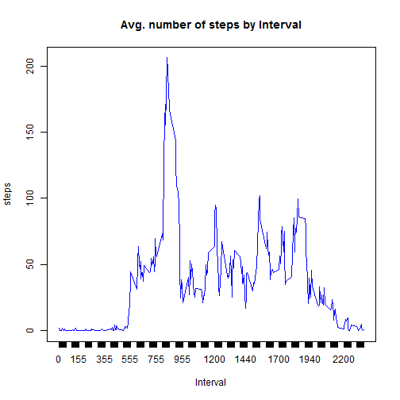
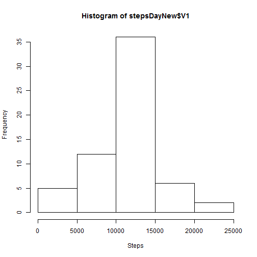

#Loading and preprocessing the data

```r
library(data.table)
Data <- data.table(read.csv("./activity.csv"))
```
#What is mean total number of steps taken per day?
Calculate total number of steps taken per day


```r
stepsDay<-data.table(with(Data,tapply(steps,date,sum)))

hist(stepsDay$V1,xlab="Steps", main="Histogram of Steps per Day")
```


```r
mean(stepsDay$V1,na.rm=TRUE)
```

```
## [1] 10766.19
```

```r
median(stepsDay$V1,na.rm=TRUE)
```

```
## [1] 10765
```

#What is the average daily activity pattern?

```r
IntervalAvg<-aggregate (steps ~ interval , data =Data, FUN = mean ) 
plot(IntervalAvg,type="l",col="blue",xaxt="n",xlab="Interval",main="Avg. number of steps by Interval")
axis(side = 1,at=IntervalAvg$interval, las = 1,labels = T)
```



Which 5-minute interval, on average across all the days in the dataset, contains the maximum number of steps?

```r
IntervalAvg<-aggregate (steps ~ interval , data =Data, FUN = mean ) 
IntervalAvg[which.max(IntervalAvg$steps),1]
```

```
## [1] 835
```

#Imputing missing values

Calculate and report the total number of missing values in the dataset


```r
sum(is.na(Data$steps))
```

```
## [1] 2304
```

Devise a strategy for filling in all of the missing values in the dataset and create a new dataset that is equal to the original dataset but with the missing data filled in


```r
missing<-which(is.na(Data$steps))
DataNew<-Data
for(i in missing){
  DataNew$steps[i]<-IntervalAvg$steps[match(Data$interval[i],IntervalAvg$interval)]
}
```

Make a histogram of the total number of steps taken each day and Calculate and report the mean and median total number of steps taken per day

```r
stepsDayNew<-data.table(with(DataNew,tapply(steps,date,sum)))
hist(stepsDayNew$V1,xlab="Steps")
```



```r
mean(stepsDayNew$V1,na.rm=TRUE)
```

```
## [1] 10766.19
```

```r
median(stepsDayNew$V1,na.rm=TRUE)
```

```
## [1] 10766.19
```
What is the impact of imputing missing data on the estimates of the total daily number of steps?
* The Impact is only on the median as it increases to the exact value of the mean.

#Are there differences in activity patterns between weekdays and weekends?

```r
library(dplyr)
library(ggplot2)
DataNew=mutate(DataNew,wd=ifelse(weekdays(as.Date(DataNew$date))=="Sunday" | weekdays(as.Date(DataNew$date))=="Saturday" , "weekend", "weekday"))
WD_Steps<-aggregate (steps ~ interval * wd, data =DataNew, FUN = mean ) 
qplot(interval, steps, data = WD_Steps)+geom_line()+facet_grid(wd ~ .)+xlab("Interval") + ylab("Avg. number of Steps")
```


As one can see in the plot there are differences between weekdays and weekends. For example activity seems to start later on the weekend and those not peak as much during the weekend.
